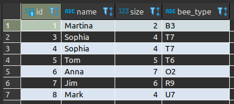

# SQLAlchemy_workbook

Workbook with functions to operate on PostgreSQL database.

_'bee_db_create_table'_ - enables to connect to the database, initialize session and create tables

_'bee_db_manipulator'_ - enables to operate on database: add records, update them, filter, order and delete.

Next steps:
-run database in a docker container.